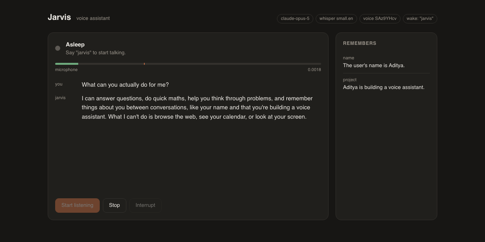

# Jarvis

A conversational voice assistant. You talk, it answers out loud, and it
remembers the conversation the next time you start it.

Audio in → [faster-whisper](https://github.com/SYSTRAN/faster-whisper) →
Claude → [ElevenLabs](https://elevenlabs.io) → audio out.



That screenshot is a real exchange - spoken aloud, transcribed locally, and
answered using what Jarvis had been told to remember earlier. The orange mark
on the meter is the level your voice has to cross for a turn to start; it is
asleep here, waiting to hear its name.

## How it works

```
 mic ──► VAD ──► whisper ──► Claude (streaming) ──► ElevenLabs ──► speaker
         │                     │      │                  ▲
   turn boundaries      tool calls  sentences ───────────┘
                             │      as they complete
                             ▼
                       SQLite memory
```

Three decisions shape everything else:

**Turn-taking is energy-based.** Whisper transcribes whatever buffer you hand
it, so something has to decide where a spoken turn starts and stops. That is
`jarvis/audio/vad.py`: it measures the room's noise floor at the start of every
listen and compares each 20 ms frame against it, so the thresholds in
`config.yaml` are ratios that hold up in a quiet room and a loud one. A
pre-roll buffer keeps the 300 ms *before* the trigger, which is what stops the
first syllable being clipped off the front.

**It only answers when spoken to.** Without a wake word, an always-listening
loop treats a television as a conversation partner - during testing it
transcribed a sitcom and answered it. `jarvis/wake.py` matches the wake word
against the transcript, fuzzily, because whisper renders the name as "Javis"
and "jarvis." often enough that exact matching does not work. Anything
unaddressed is transcribed, shown greyed in the app, and dropped before it
reaches Claude. After it answers, a 45-second window stays open so a follow-up
question is just a follow-up question.

**Replies are spoken sentence by sentence.** Claude's output is streamed, cut
into sentences as they complete (`jarvis/text.py`), and each one is sent to
ElevenLabs while the next is still being written. Waiting for the full reply
before synthesising would add its whole generation time to the pause before
Jarvis says anything.

**Memory has three layers.** Every turn is written to SQLite verbatim. When a
session outgrows the prompt budget its older turns are folded into a summary.
Durable things about you — a name, a preference, a project — are stored as
*facts*, which Claude writes deliberately through the `remember_fact` tool and
which are in the prompt of every future session.

## Setup

Needs Python 3.11–3.13. (`ctranslate2`, under faster-whisper, has no 3.14
wheels yet, so 3.14 will fail to install.)

```bash
python3.13 -m venv .venv
.venv/bin/pip install -r requirements.txt
cp .env.example .env   # then add your two API keys
```

Check everything before you talk to it:

```bash
.venv/bin/python run.py doctor
```

That verifies both keys, finds your audio devices, downloads and loads the
whisper model, and makes one small Claude request. The first run downloads
~500 MB for `small.en`.

macOS will ask for microphone permission the first time you run `talk` or
`listen`. If it never asks and there is no input device, grant it under System
Settings → Privacy & Security → Microphone for your terminal.

## Using it

```bash
.venv/bin/python run.py app
```

That opens Jarvis in your browser: press Start, and you get live state, a
microphone meter with the trigger threshold marked on it, the transcript as it
happens, and what Jarvis remembers about you. It works the same on macOS,
Windows and Linux, because the browser is the only GUI that does.

The audio never goes near the browser - microphone, whisper, ElevenLabs and the
speaker all stay in the Python process, and the page is a view and three
buttons. The server is standard library only and binds to loopback, since this
process holds your microphone and both API keys.

For a double-clickable launcher:

```bash
.venv/bin/python scripts/make_launchers.py
```

That writes `launchers/Jarvis.app` (macOS - drag it to the Dock),
`launchers/Jarvis.bat` (Windows) and `launchers/jarvis.desktop` (Linux). They
hold absolute paths, so they are generated rather than committed - re-run it
after moving or cloning the project.

Or stay in the terminal:

```bash
.venv/bin/python run.py talk
```

Speak; pause; it answers. Say "goodbye Jarvis" or ask it to stop, and it ends
the session and writes a summary for next time. Ctrl-C also exits cleanly.

Other commands:

| Command | What it does |
|---|---|
| `app` | The browser UI. Say the wake word to start talking. `-p` changes the port, `--no-browser` skips opening it. |
| `chat` | Same brain, same memory, over the keyboard. No mic, no API spend on TTS. |
| `say "text"` | Speak one line. Checks ElevenLabs and your speakers. |
| `listen -o out.wav` | Capture one utterance the way `talk` does, and transcribe it. |
| `transcribe f.wav` | Run STT over a file. |
| `calibrate` | Measure your room and print suggested VAD settings. |
| `devices` | List audio devices, with the defaults marked. |
| `voices` | List the ElevenLabs voices on your account. |
| `memory` | Show remembered facts and past session summaries. `--forget KEY` deletes one. |
| `doctor` | Check keys, audio, whisper, and Claude. |

Add `-v` to any of them for timings, token counts, and VAD decisions.

## Tuning

Everything lives in `config.yaml`; secrets live in `.env`.

**It does not hear me / it triggers on nothing.** Run `run.py calibrate`. It
measures your noise floor and speaking level and prints the `vad:` block to
paste in.

**It cuts me off mid-sentence.** Raise `vad.silence_hangover_ms`. That is how
long a pause may run before the turn is considered over — 800 ms suits brisk
speech, 1200 ms suits thinking out loud.

**It is too slow to start talking.** Drop `stt.model` to `base.en` or
`tiny.en`; whisper's load is usually the biggest share. `model.effort` is
already `low`. Cutting `vad.silence_hangover_ms` also helps, at the cost of
being interrupted more.

**Wrong microphone.** `run.py devices`, then set `audio.input_device` to the
index or name.

**Interrupting it.** `barge_in.enabled` is off by default. With open speakers
and no echo cancellation, Jarvis hears its own voice and interrupts itself
after half a sentence. Turn it on if you wear headphones.

## Known limitations

**The wake word is matched on the transcript, not the audio.** While asleep,
whisper still runs on every noise burst - it is the reply that is withheld, not
the transcription. That costs CPU but no money and no absurd answers. A
dedicated engine (Porcupine, openWakeWord) would skip whisper entirely and use
far less power, at the price of a heavy dependency, a model file, and in
Porcupine's case a third API key. Worth revisiting if this ever runs on
battery.

**Barge-in is off by default.** Interrupting Jarvis mid-sentence needs acoustic
echo cancellation, which this does not have; on open speakers it hears its own
voice and interrupts itself. Turn it on in `config.yaml` when you are wearing
headphones.

**Bluetooth devices hijack the defaults.** macOS points the default input and
output at whatever Bluetooth device is connected, so a car handsfree can
silently become both your microphone and your speaker. `audio.input_device` and
`audio.output_device` are pinned by name in `config.yaml` for that reason -
change them to match your machine, and use `run.py devices` to see the names.

**It will not deploy to a server.** It needs a microphone, speakers, and a
long-lived process holding a ~500 MB model in memory. That is a local
application, not a web service.

## Model and cost

`claude-opus-5` at `effort: low` — low effort rather than thinking disabled,
because with thinking off Opus 5 will occasionally narrate a tool call as plain
text instead of emitting it, which in a spoken loop sounds exactly like Jarvis
lying about what it just did. Opus 5 is $5/$25 per million tokens; a voice turn
is small, and the system prompt is cached. Switch to `claude-sonnet-5` in
`config.yaml` if you would rather trade quality for cost.

ElevenLabs `eleven_flash_v2_5` is their lowest-latency model, and audio comes
back as raw 16 kHz PCM so there is no decode step and no ffmpeg dependency.

The default voice is a *premade* one (`River`). Free accounts cannot use
*library* voices through the API - those fail with a 402, not a permissions
error - so if you change `tts.voice_id`, pick from `run.py voices`.

## Layout

```
run.py                 CLI: every command above
config.yaml            behaviour            .env  secrets
jarvis/
  assistant.py         Assistant (a conversation) + VoiceSession (the audio loop)
  wake.py              wake word matching, fuzzy, on the transcript
  events.py            pub/sub bus - the console and the browser both subscribe
  web/server.py        stdlib HTTP + server-sent events
  web/ui.html          the app, one self-contained page
  brain.py             Claude: streaming, the tool loop, summarisation
  memory.py            SQLite: turns, session summaries, facts
  tools.py             remember_fact, forget_fact, get_current_time, end_conversation
  prompts.py           system prompt and the remembered-context blocks
  stt.py               faster-whisper, with hallucination filtering
  tts.py               ElevenLabs
  text.py              sentence chunking, markdown stripping
  audio/
    vad.py             turn detection
    recorder.py        microphone capture
    player.py          interruptible playback
scripts/               make_launchers.py
tests/                 pytest; no API keys or audio hardware needed
```

## Tests

```bash
.venv/bin/pip install -r requirements-dev.txt
.venv/bin/python -m pytest tests -q
```

They cover the parts that are painful to check by talking to it: turn detection
against synthetic audio, sentence chunking across arbitrary stream boundaries,
the memory window, and the streaming tool loop against a stubbed API.

## License

MIT - see [LICENSE](LICENSE).
